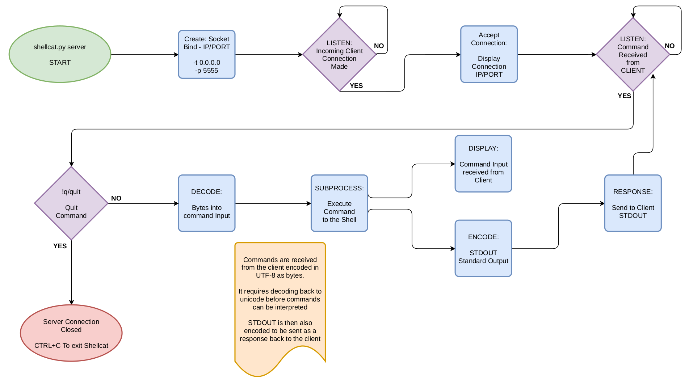
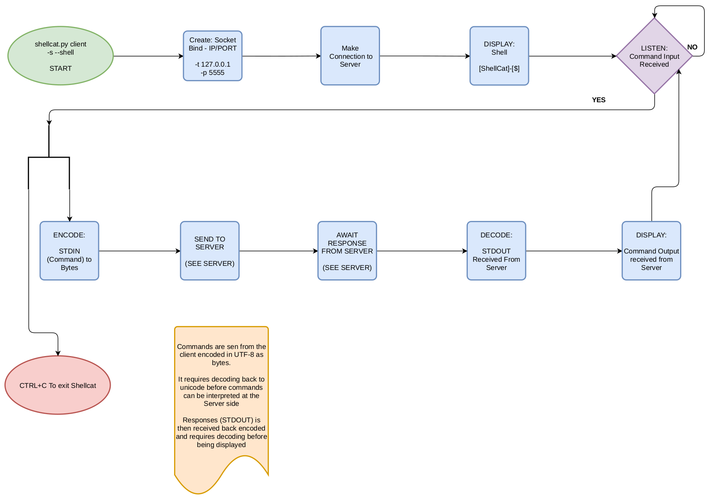

# ShellCat.py

<br />

## Description

**shellcat.py**

The following standard Python libraries are being used - No additional python modules need to be downloaded or installed for shellcat to function

-   argparse

    -   Used to create CLI arguments that are needed to launch specific server/client operations - includes CLI examples on how to operate shellcat.py

-   os

    -   Used to handle error related to threading when KeyboardInterrupt is detected

-   signal

    -   Used in this case for error handling and to allow management of errors more efficiently. Avoiding having to us try and except statements for some exception handling.

        -   BrokenPipeError: Caused when Server drops or closes and Client is trying to send commands

            -   SIGPIPE

            note: the shellcat.py shell will close and return back to users own terminal CLI no error output is displayed to user

        -   KeyboardInterrupt: Caused when CTRL + C is issued by the user

            -   SIGINT

            note: message displayed to the user that a KeyboardInterrupt was detected

-   socket

    -   Used to bind IP and Ports, creating a network socket for connections to be made locally or remotely across networks.

-   subprocess

    -   Used to allow native system commands (Linux) to operate from a python application

-   sys

    -   Used to support interactive standard input (stdin) calls from Client

-   textwrap

    -   Used to help display argparse arguments by allowing text-wrapping

-   threading

    -   Used to handle multiple inputs/ouputs to be processed from multiple clients at one time

        -   will prove handy when pivoting and allowing multiple server/clients to interact with one another simultaneously

<br />

### Using shellcat

Examples:

<br />

**Help**

Top Level:

```
python3 shellcat.py -h
```

```
python3 shellcat.py --help
```

<br />

Sub Level:

Server

```
python3 shellcat.py server -h
```

```
python3 shellcat.py server --help
```

Client

```
python3 shellcat.py client -h
```

```
python3 shellcat.py client --help
```

<br />

**ServerMode**

```
python3 shellcat.py server -t 172.16.1.25 -p 5555
```

```
python3 shellcat.py server -p 5555
```

-   Specify the IP address of the server and a port to use.

    -   The -t flag is optional and will revert to 0.0.0.0 if not used.

    -   Ports 1024 and above are NON-well-known ports and are recommended to use, so avoid using ports 1 - 1023.

-   Once the Server is launched, a Client can be established and connect to the server

```
sudo python3 shellcat.py server -p 5555
```

-   append sudo to the beginning if Sudo privileged commands are required.

<br />

**ClientMode**

Default:

```
python3 shellcat.py client -t 172.16.1.25 -p 5555
```

Shell (-s or --shell)

```
python3 shellcat.py client -t 172.16.1.25 -p 5555 -s
```

-   Specify the server's IP address to connect to and the port the server has opened for use.

-   Using the -s or --shell flag for an interactive shell

<br />

<br />

Establishing a server at one end whereby the commands are to be executed within and utilising a client that will connect into the server and remotely execute commands

Currently set up for allowing five client connections to work simultaneously.

<br />

### ServerMode: (server-side)

1. Binding an IP and Port to create a socket that python can use to establish an open connection for a client to connect into

To achieve this, sockets(standard-library) is needed.

2. The Server needs to accept incoming connections from a client, and if more than one client is connecting to the server, threading(standard-library) is used to handle multiple the connection requests

Once the connection has been established, the server displays who has connected in (server-side)

3. The server then needs to continue handling the connections once established and processing incoming commands from clients as they are received whilst keeping the session alive.

The commands received from clients are then decoded on the server, allowing commands to function correctly. Once decoded, the subprocess(standard-library) allows the proper execution of commands. Finally, responses (output) are then encoded before being sent back to the client as a response.

4. The standard output from a command is a string, and for it to function across a network(sockets), it must first be formatted into bytes.

A 4096 bytes buffer size should be enough - however, manually altering this to 8192 bytes may be required for larger buffers if data is lost in transmission.

-   use an editor and open shellcat.py
-   search text: 4096
-   replace text: 8192

<br />

### ClientMode: (client-side)

1. Again, you need to bind an IP and Port to form a socket before establishing a connection into a server.

2. The server should then accept the incoming connection from the client. Now at this point, commands can be sent from the client to the server. Encoding, including converting to bytes, is processed at the time of submitting per command entered.

3. Commands will be received at the server-side and executed, and any responses are sent back to the client as stdout (standard output). This allows the user on the client-side to see if the command was executed and functioned correctly.

<br />

<br />

Shellcat is a Netcat like utility allowing the execution of commands remotely from a client to a target/server.

Default:
The default mode will allow connecting to web apps for testing connections and is currently under maintenance.

Default mode can still be used to submit commands from the client to the server; however, it requires pressing CTRL+D after entering a command to execute. This is because it reads from STDIN and then requires an end-of-file (EOF) marker to be received at the server-side, essentially indicating command entry is complete.

Best practise would be to utilise Shell mode for a better interactive shell when needing to execute commands

Shell:
Use this for an interactive live shell (reverse shell). Submit commands as if you were directly on the server itself.

<br />

Some noted commands not currently working are:

-   cd (change directory)

Futher Development is required to resolve

<br />

POC: Commands currently working and tested

-   cat {file}
-   cat /etc/passwd
-   pwd
-   ls
-   ls -alh /home/{user}/Downloads
-   ifconfig

Most commonly used linux commands that return STDOUT should work

<br />

Future features:

-   Upload - Allow transfer of files to a server from the client.

-   Execute - Allow a one time command to be run by connecting, executing cmd and disconnecting immediately

<br />

This application was purposely written as a single file (shellcat.py) to allow for simple file transferring over networks to reduce detection with IPS/IDS - Stealth in mind.

Shellcat is a secondary backup tool if Netcat is not installed on the target/victim machine, but Python just so happens to be, you can launch this Netcat-like replacement.

<br />

<br />

## Flow-Chart

<br />

### Server



<br />

### Client


